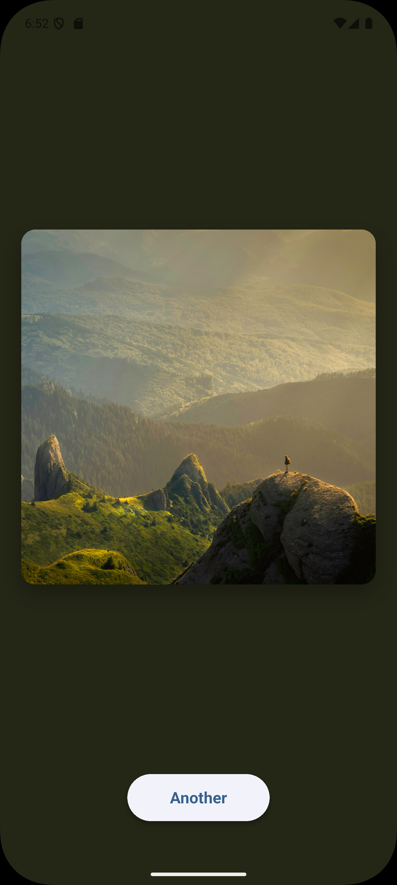
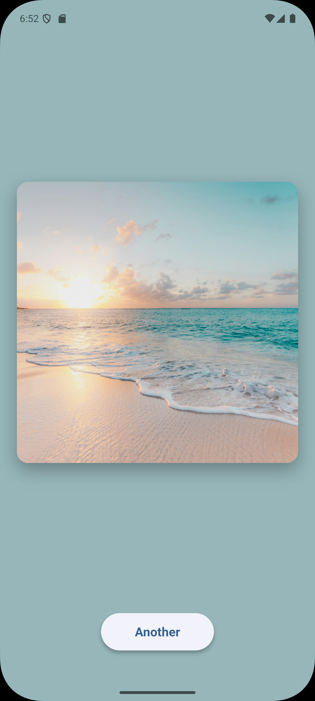

# Random Image Viewer

This is a Flutter app that fetches and displays random images from Unsplash with an adaptive, immersive color background.

## Features

- **Random Image Display**: Fetches images from a custom API endpoint
- **Adaptive Background**: Background color automatically adapts to match the dominant colors of the displayed image
- **Smooth Animations**: Fade-in transitions for images and smooth background color changes
- **Responsive Design**: Square image centered on screen with proper aspect ratio
- **Loading States**: Visual feedback while fetching images
- **Error Handling**: Graceful error messages when network requests fail
- **Dark Mode Support**: Respects system light/dark mode preferences
- **Full Accessibility Support**:
  - Complete TalkBack/VoiceOver support with Semantics widgets
  - Descriptive labels for all UI elements
  - Live region announcements for loading and error states
  - Button hints and tap feedback
  - Image descriptions and navigation hints
  - Screen reader friendly navigation

## Screenshots

<div align="center">
  
  
  
</div>

_The app displays random images from Unsplash with adaptive background colors that match the image's dominant colors._

## Demo Video

See the app in action with full TalkBack accessibility demonstration:

[📹 Screen Recording](demo/screen_recording.mp4)

## API

The app uses the following API endpoint:

- **URL**: `https://november7-730026606190.europe-west1.run.app/image`
- **Method**: GET
- **Response**: `{"url": "https://images.unsplash.com/photo-..."}`

## Technical Details

### Dependencies

- **flutter**: UI framework
- **http**: Making API requests
- **cached_network_image**: Efficient image loading and caching
- **palette_generator**: Extracting dominant colors from images

### Key Implementation Features

1. **API Integration**: Fetches random image URLs from the backend endpoint
2. **Color Extraction**: Uses `palette_generator` to extract dominant colors from images
3. **Image Caching**: Implements `CachedNetworkImage` for better performance and offline support
4. **Smooth Transitions**:
   - 500ms fade-in animation for images
   - 800ms animated background color transition
5. **Error Handling**: 10-second timeout with user-friendly error messages
6. **Material Design 3**: Modern UI with elevated buttons and rounded corners
7. **Comprehensive Accessibility**:
   - Semantics widgets throughout the UI
   - TalkBack (Android) and VoiceOver (iOS) support
   - Live region updates for dynamic content
   - Descriptive labels and hints for all interactive elements
   - Proper focus management and navigation order

## Getting Started

### Prerequisites

- Flutter SDK (3.10.0 or higher)
- Dart SDK
- Android Studio / Xcode for mobile development
- A physical device or emulator

### Test Device

This app has been tested on:

- **Samsung Galaxy S20 FE 5G** (Android) with TalkBack enabled

### Installation

1. Clone the repository:

```bash
git clone https://github.com/Chandler-Ma-1209/random-image-viewer.git
cd random-image-viewer
```

2. Install dependencies:

```bash
flutter pub get
```

3. Run the app:

```bash
flutter run
```

### Building for Release

#### Android

```bash
flutter build apk --release
```

#### iOS

```bash
flutter build ios --release
```

## Project Structure

```
lib/
  └── main.dart          # Main application code
```

## Usage

1. Launch the app
2. The app automatically fetches and displays a random image
3. The background color adapts to match the image
4. Tap the "Another" button to load a new random image
5. Enjoy the smooth transitions and immersive experience!

### Accessibility Features (TalkBack/VoiceOver)

**For visually impaired users:**

1. **Enable TalkBack (Android)** or **VoiceOver (iOS)** on your device
2. Navigate through the app using swipe gestures:
   - **Screen container**: Announces "Random Image Viewer"
   - **Image area**: Provides description and current state (loading, loaded, or error)
   - **Another button**: Announces button status and provides action hints
3. **Double-tap** on the "Another" button to load a new image
4. **Live updates**: Loading states and errors are announced automatically
5. **Context hints**: Each element provides helpful navigation hints

**TalkBack Navigation Order:**

- Random Image Viewer (screen)
- Image display area (with status)
- Another button (with action hint)

**Announced States:**

- "Loading image, please wait while the image is being fetched"
- "Random image displayed, Image from Unsplash"
- "Error occurred, Failed to load image. Tap Another button to try again"
- "Loading new image, please wait" (when button is pressed)

## Development

### Code Organization

The app is built as a single-page application with:

- `MyApp`: Root widget with theme configuration
- `RandomImageScreen`: Main screen (stateful widget)
- `_RandomImageScreenState`: Handles state management, API calls, and color extraction

### Key Methods

- `_fetchRandomImage()`: Fetches image URL from API
- `_extractColors()`: Extracts dominant colors using palette generator
- `_buildImageWidget()`: Renders the image with loading/error states
- Animation controller for smooth fade transitions

### Development Approach

This project was developed with AI assistance (GitHub Copilot powered by Claude Sonnet 4.5). I designed the architecture, selected the dependencies, and built the project framework, while AI assisted in accelerating the implementation. I believe that **agentic AI represents the future of software engineering** - when skilled developers leverage AI as a tool, it can dramatically improve development efficiency while maintaining full control over code quality and design decisions.

The combination of human expertise and AI assistance allows for:

- Developer-driven architecture and design decisions
- Rapid implementation of best practices with AI assistance
- Comprehensive accessibility features from the start
- Clean, well-documented code
- Focus on user experience and code quality while AI assists with implementation details

This collaborative approach enabled delivering a polished, production-ready app with full accessibility support efficiently, with the developer maintaining oversight and making all key technical decisions.

## License

This project is created as part of Aurora Engineering Assessment.

## Author

Jiahua Ma (Chandler-Ma-1209)

## References

- **Demo Video**: [demo/screen_recording.mp4](demo/screen_recording.mp4)
- **Screenshots**: Available in [screenshots/](screenshots/) folder
- **API Endpoint**: https://november7-730026606190.europe-west1.run.app/image
- **Repository**: https://github.com/Chandler-Ma-1209/random-image-viewer
